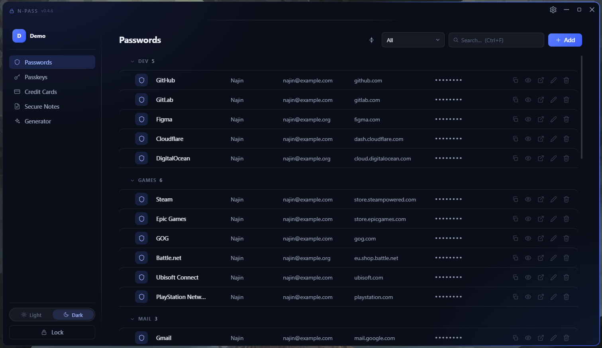
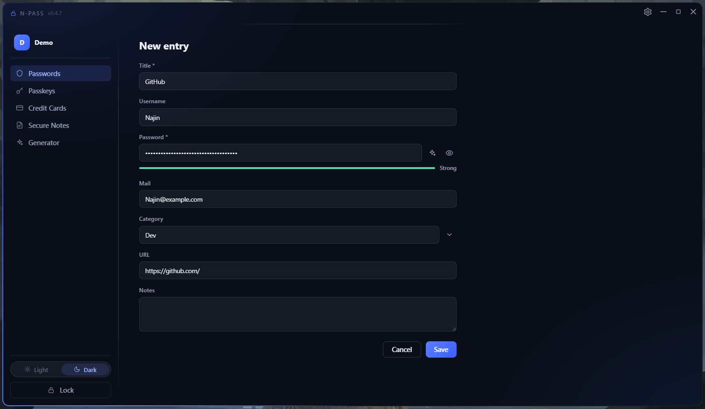
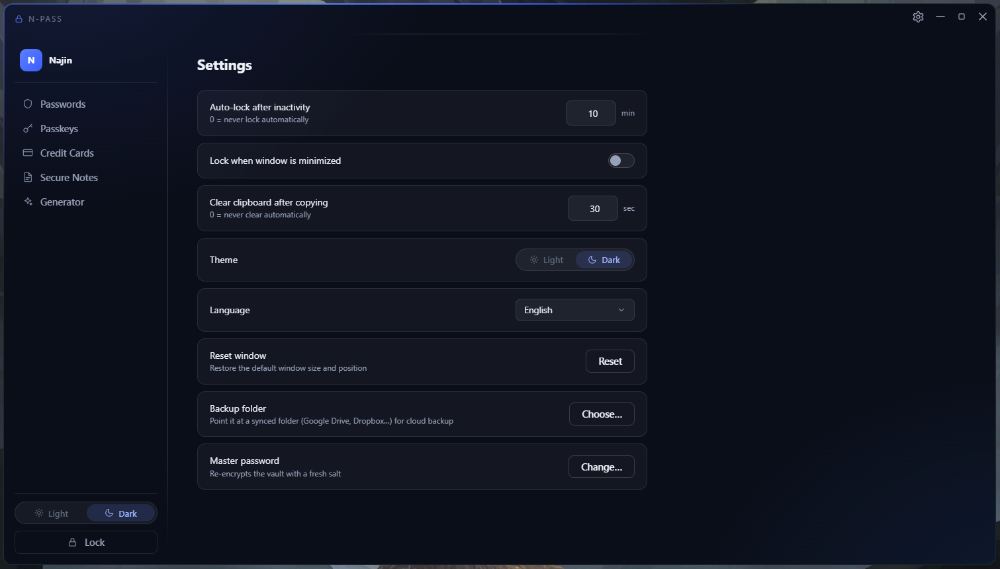

# N-Pass

[English](README.md) | **Русский**

N-Pass — маленький и быстрый менеджер паролей, который хранит все ваши
секреты **на вашем собственном компьютере**, в одном зашифрованном
файле. Без аккаунтов, без облака, без подписок, без телеметрии. Если вы
никогда не пользовались менеджером паролей — начните со следующего
раздела.



---

## Что такое менеджер паролей — за одну минуту

Вместо того чтобы помнить десятки паролей (или, хуже, использовать один
и тот же), вы запоминаете **один мастер-пароль**. Всё остальное —
логины, банковские карты, заметки, API-ключи — лежит в зашифрованном
хранилище, которое открывается только этим мастер-паролем. Нужное
копируется одним кликом, а при вашем отсутствии приложение блокируется
само.

Два правила, которые важно понять до начала:

1. **Мастер-пароль — единственный ключ.** Он нигде не хранится и не
   подлежит восстановлению. Забыли — данные потеряны навсегда. Запишите
   его и храните в надёжном месте.
2. **Данные не покидают ваш компьютер**, пока вы сами не настроите
   папку бэкапа. Никаких серверов.

## Установка

Скачайте свежую сборку со страницы [Releases](../../releases):

| Файл | Что это |
| --- | --- |
| `N-Pass_x.y.z_x64-setup.exe` | Установщик — ставится в папку пользователя, права администратора не нужны |
| `n-pass.exe` | Портативная версия (рекомендуется) — положите в любую папку и запускайте |

Требования: Windows 10/11 x64 с WebView2 (есть в любой обновлённой
системе).

> **При первом запуске появилось «Система Windows защитила ваш
> компьютер»?** Это синее окно показывается для любой программы без
> платного сертификата подписи — у N-Pass его нет. Нажмите
> **Подробнее → Выполнить в любом случае**. Если верить на слово не
> хочется, приложение можно собрать из исходников самому — см. последний
> раздел.

## Первые шаги

1. Запустите N-Pass → нажмите **Новый профиль** в правом нижнем углу.
2. Придумайте имя и **мастер-пароль** (индикатор подскажет, насколько
   он надёжен — стремитесь к «Надёжный»).
3. Готово. Добавьте первый пароль кнопкой **Добавить**.
4. Уходя, нажмите **Заблокировать** (или **Ctrl+L**).

Каждый профиль — отдельный файл-хранилище: у каждого члена семьи может
быть свой, со своим мастер-паролем.



## Как выбрать мастер-пароль

Это единственный пароль, который вам придётся помнить, — на него стоит
потратить минуту:

- **Длина важнее «хитрости».** Четыре случайных слова —
  `кофе-якорь-фиалка-лампа` — и запоминаются легче, и взламываются
  тяжелее, чем `P@ssw0rd!`.
- **Не берите пароль, который уже где-то используете.** Утечёт тот сайт
  — хранилище не должно пострадать.
- **Запишите его на бумаге** и положите туда, где храните документы. Это
  не паранойя: ссылки «восстановить пароль» не существует, и открыть
  ваше хранилище не сможет никто — включая автора программы.
- Не храните его в текстовом файле на том же компьютере.

Поменять пароль можно в любой момент: **Настройки → Мастер-пароль →
Изменить**. Хранилище при этом перешифровывается заново.

## Что в каком разделе хранить

| Раздел | Что туда класть |
| --- | --- |
| **Пароли** | Логины от сайтов и программ: название, логин, почта, пароль, ссылка, заметки |
| **Ключи** | Любая одиночная секретная строка: API-ключ, лицензионный ключ, пароль от Wi-Fi, код восстановления |
| **Банковские карты** | Номер, держатель, срок, CVV, платёжная система |
| **Заметки** | Свободный текст: паспортные данные, код от подъезда, что угодно личное |

> Про название: **Passkeys** здесь — это «ключи» в обычном смысле, длинные
> секретные строки, которые куда-то вставляют. Это не стандарт
> беспарольного входа WebAuthn — такие ключи N-Pass не создаёт.

## Как пользоваться сохранённым паролем

N-Pass не вводит пароли на сайтах за вас (ни расширения для браузера, ни
автозаполнения — см. [не-цели](#осознанные-не-цели)). Повседневный
сценарий — копирование, и занимает он секунды три:

1. Найдите запись — начните печатать в поле поиска или нажмите **Ctrl+F**.
2. Нажмите иконку **копирования** (⧉) справа в строке. На экране ничего
   не появится: пароль уходит сразу в буфер обмена.
3. Переключитесь на сайт и вставьте его через **Ctrl+V**.
4. И забудьте — через 30 секунд буфер очистится сам, пароль не останется
   там до конца дня.

Нужно пароль именно **увидеть** (например, чтобы набрать его на
телефоне)? Нажмите иконку **глаза** — значение покажется прямо в строке
и спрячется по второму нажатию.

Скопировать что-то кроме пароля — логин, почту, ссылку — можно так:
наведите на это значение и нажмите появившуюся рядом маленькую кнопку
копирования либо кликните в значение и нажмите **Ctrl+C**.

## Как навести порядок в списке

Когда записей становится больше десятка, список превращается в простыню.
Помогают две вещи: **категории**, которые собирают записи под заголовки, и
**перетаскивание**, которое расставляет их в удобном вам порядке.

### Категории: просто впишите слово

Категория — это всего лишь слово, которое вы вписали в запись. Никакого
списка заводить заранее не нужно, кнопки «создать категорию» нигде нет.

Допустим, вы сохраняете учётную запись GitHub. В форме есть поле
**Категория** — впишите туда `Dev` и сохраните. Готово: категория теперь
существует, а GitHub встал в списке под заголовком **DEV**. Сохраните
GitLab с тем же словом — он попадёт в ту же группу.

Поле подсказывает слова, которые вы уже использовали, так что точное
написание помнить не нужно: начните набирать `D`, и вам предложат `Dev`.
Выбор из подсказки заодно спасает от того, чтобы получить `Dev` и `dev`
двумя разными группами.

Категория исчезает сама, когда пропала последняя запись с ней, — убирать
за собой не придётся. Записям, которым никуда не нужно, поле можно
оставить пустым: они соберутся внизу под заголовком **Без категории**.

### Показать одну категорию

Выпадающий список рядом с поиском (на нём написано **Все**) оставляет на
экране только одну категорию. Выберите `Games` — останутся только игры;
выберите **Все** — вернётся весь список.

### Свернуть лишнее

Нажмите на заголовок — группа свернётся, останется только сам заголовок и
число записей рядом с ним. Нажмите ещё раз, чтобы развернуть.

Кнопка слева от выпадающего списка делает то же самое сразу со всеми:
сверните всё, чтобы увидеть структуру целиком на одном экране, и
разверните обратно. Какие группы вы оставили свёрнутыми, программа
запоминает — при следующем запуске всё будет так, как вы оставили.

### Расставить категории в своём порядке

Изначально категории идут по алфавиту, поэтому `AI Agents` оказывается
выше `Dev`. Если вы открываете `Dev` по десять раз на дню, логичнее
держать его первым.

Наведите курсор на заголовок — слева появится **ручка**, шесть маленьких
точек. Возьмитесь за неё и тяните заголовок вверх или вниз. Яркая линия
показывает, куда категория встанет; отпустите кнопку мыши — она туда и
переедет.

Пока вы тянете, записи убираются с дороги и остаются одни заголовки — то
есть вы двигаете категорию по короткому списку, а не тащите её через
экран чужих строк. Передумали? Нажмите **Esc** до того, как отпустите
кнопку, и ничего не произойдёт.

Порядок хранится внутри самого файла хранилища и потому переезжает вместе
с ним: скопируйте хранилище на другой компьютер — категории останутся
расставленными по-вашему.

### Переименовать категорию целиком

Допустим, вы назвали её `dev`, а хочется `Work Dev`. Править десять
записей руками — тоска, и делать этого не нужно.

Наведите курсор на заголовок, нажмите кнопку **...** справа от него и
выберите **Переименовать категорию**. Заголовок превратится в поле ввода:
наберите новое имя и нажмите **Enter** (или **Esc**, если передумали).
Все записи этой категории поменяются за один раз, а сама категория
сохранит своё место в вашем порядке.

Если переименовать в имя, которое уже занято — скажем, `dev` в `Work`,
когда `Work` уже есть, — две группы объединятся в одну. Программа
предупредит об этом заранее.

### Переставить сами записи

Строки работают так же, как заголовки: наведите курсор на строку,
возьмитесь за ручку слева, тяните вверх или вниз и отпустите. **Esc**
отменяет.

Одно правило стоит знать: **строку можно двигать только внутри её
категории.** Если потянуть `GitHub` из `Dev` в сторону игр, линия просто
не появится — такое перетаскивание не предлагается. Так сделано намеренно:
категория — это свойство, записанное в самой записи, а не место на экране.
Строка, брошенная в чужую группу, всё равно вернулась бы обратно, и это
выглядело бы как поломка.

Чтобы действительно перенести запись в другую категорию, откройте её
карандашом и поменяйте поле **Категория**.

## Где лежат мои данные?

В папке `vaults` **рядом с исполняемым файлом**:

```
N-Pass/
├── n-pass.exe
├── window-state.json     ← запомненный размер/позиция окна (можно удалять)
└── vaults/
    ├── Najin.npass                              ← ваше зашифрованное хранилище
    ├── Najin.npass.2026-08-20_071530.bak        ← версия до текущей
    └── Najin.npass.2026-08-19_183012.bak        ← и предыдущая
```

Файл `.npass` самодостаточен: скопируйте его на другой компьютер,
откройте тем же мастер-паролем — и всё на месте. Это же означает, что
**резервная копия = копия одного файла**.

## Резервные копии и восстановление

Защита устроена в три слоя, и полезно понимать, за что отвечает каждый —
они не заменяют друг друга.

**1. Файлы `.bak` — две последние версии, сохраняются сами.** При
каждом сохранении N-Pass сначала пишет новую версию во временный файл,
затем откладывает текущее хранилище под именем с отметкой времени вроде
`Najin.npass.2026-08-20_071530.bak` и только потом ставит новый файл на
место. Поэтому даже если посреди сохранения выключат свет, на диске
всегда остаётся целое, читаемое хранилище.

Хранятся две последние версии, более старые удаляются сами — папка не
разрастается. Чтобы вернуться к одной из них: закройте N-Pass,
переименуйте `Najin.npass` во что-нибудь другое, нужный `.bak`
переименуйте в `Najin.npass` и запустите приложение. Отметка в имени —
местное время, так что выбрать нужную версию можно прямо в проводнике.

Это заодно закрывает случай, который программа не в состоянии заметить:
вы скопировали старое хранилище поверх нового в проводнике, при закрытом
приложении. Изнутри такое не отследить — но версия, которую вы затёрли,
осталась лежать рядом.

⚠️ **Это не отмена действия.** В них лежит состояние на одно и на два
сохранения назад, а сохраняется *каждое* изменение: добавили запись,
отредактировали, перетащили, переключили настройку. Если случайно
удалили запись и сделали после этого пару действий — удаление попало в
обе копии. Для таких случаев есть слои 2 и 3.

**2. Папка бэкапа (Настройки → «Папка бэкапа») — защита от потери
компьютера.** Укажите папку, которую синхронизирует Google Drive,
Dropbox или OneDrive: N-Pass кладёт туда копию зашифрованного хранилища
после каждого изменения, а клиент облака заливает её. Бонус: эти сервисы
хранят собственную историю файла, и через их веб-интерфейс можно
откатиться на *вчерашнюю* версию — именно это и спасает от случайного
удаления.

**3. Копия файла своими руками — самый простой слой.** Любая копия
`Najin.npass` на флешке или другом диске — это полноценный бэкап. Он
открывается тем мастер-паролем, который действовал в момент копирования.

⚠️ О чём часто забывают: если вы меняли мастер-пароль, старые копии
(включая `.bak`) открываются **прежним** паролем — они им и зашифрованы.
Файл, который кажется «битым», нередко просто ждёт старый пароль.

## Одно хранилище из нескольких мест

**N-Pass запускается только в одном экземпляре.** Запустите его ещё раз —
и на передний план выйдет уже открытое окно, а не появится второе. Два
окна над одним хранилищем держали бы его в памяти каждое своё, и то, что
сохранилось последним, молча затёрло бы работу другого.

Остаётся случай, который снаружи не предотвратить: один и тот же файл,
доступный с двух компьютеров через синхронизируемую папку, или резервная
копия, возвращённая на место при открытой программе. **Здесь происходит
слияние, а не перезапись.**

Каждая запись помнит, когда её меняли в последний раз, а каждое удаление
оставляет след. Поэтому, обнаружив при сохранении, что файл изменился,
программа не заменяет одну версию другой, а складывает их:

- запись, которая есть только у другой стороны, забирается;
- запись, изменённую с обеих сторон, побеждает более поздняя;
- удаление остаётся в силе — если только запись не правили **после**
  удаления: значит, она понадобилась позже, чем от неё избавились.

Вам сообщат, что это произошло, — «из другой копии перенесено изменений:
N», — и ничего не спросят.

Двух вещей это не умеет. Если перезаписать хранилище в проводнике при
закрытой программе, сливать нечего: она этого не видела, и путь назад —
через прошлые версии, лежащие рядом. И порядок, в который вы перетащили
записи, не сливается: остаётся тот, что был у сохраняющей копии.

## Возможности

- **Поиск** по всему с **Ctrl+F** — несколько слов в любом порядке;
  заметки ищутся по полному тексту.
- **Умный Ctrl+C**: кликните в любое значение в списке (логин, URL…) и
  нажмите Ctrl+C — скопируется всё поле. Выделили часть — скопируется
  часть. Срок карты копирует ММ или ГГ в зависимости от позиции
  курсора; номер карты копируется без разделителей.
- Каждое копирование проходит через **автоочистку буфера**: через 30
  секунд (настраивается) буфер очищается — если там всё ещё лежит то,
  что положил N-Pass.
- **Открытие ссылки**: кнопка ↗ (или правый клик по ссылке) открывает
  сайт в браузере. Адрес можно записывать как удобно — `discord.com`,
  `www.discord.com` или полностью `https://…`, N-Pass разберётся. В списке
  ссылки показываются в коротком виде (`discord.com/invite/abc`), чтобы
  место занимал домен и путь, а не `https://www.`; копируется при этом
  ровно тот адрес, который вы сохранили — схема важна для роутеров и
  внутренних сервисов.
- **Категории** для паролей: вписали слово в запись — группа есть.
  Заголовки сворачиваются, весь список — одной кнопкой, категории можно
  расставить перетаскиванием и переименовать целиком за один раз —
  всё по шагам в разделе
  [Как навести порядок в списке](#как-навести-порядок-в-списке).
- **Drag & drop** с линией-индикатором места вставки; **Esc** отменяет.
- **Автоблокировка** по бездействию (по умолчанию 10 минут) и, по
  желанию, при сворачивании окна. Блокировка затирает ключ шифрования и
  расшифрованные данные из памяти.
- **Бэкап в папку**: укажите папку, синхронизируемую Google Drive,
  Dropbox или OneDrive — их клиент сам зальёт зашифрованное хранилище в
  облако после каждого изменения. Само приложение в сеть не выходит.
- Тёмная и светлая темы; английский, русский и украинский интерфейс.
- Окно при первом запуске подстраивается под ваш монитор, а дальше
  помнит размер и позицию, которые вы ему задали (Настройки → «Сбросить
  окно» возвращает вид по умолчанию).
- **Секреты по умолчанию скрыты.** Значение показывается только по
  нажатию на глаз, и любая существующая запись снова открывается под
  точками — раскрытие всегда остаётся вашим осознанным действием.
  Единственное исключение — поле пароля у *новой* записи: оно помнит,
  оставили вы его открытым или нет. Причина в цене ошибки: засвеченный
  пароль перегенерируется одним кликом, а выданный ключ или CVV карты —
  нет, поэтому они всегда начинают скрытыми. У страницы генератора свой
  глаз, он тоже запоминается.
- Встроенный **генератор паролей** (длина, наборы символов) — плюс
  кнопка ✨ прямо в форме записи: один клик заполняет поле пароля по
  вашим последним настройкам генератора.
- **Смена мастер-пароля** с перешифровкой хранилища на новой соли.



## Горячие клавиши

| Клавиши | Что делают |
| --- | --- |
| **Ctrl+F** | Перейти в поле поиска |
| **Ctrl+C** | Скопировать поле, в котором стоит курсор (или только выделенное) |
| **Ctrl+L** | Мгновенно заблокировать хранилище |
| **Esc** | Очистить поиск / отменить перетаскивание / закрыть меню |

## Частые вопросы

**Я забыл мастер-пароль. Что делать?**
Ничего — в этом и смысл конструкции. Пароль нигде не хранится, даже в
виде хеша, поэтому сбрасывать и восстанавливать нечего. Данные в
хранилище потеряны. Именно поэтому приложение так настойчиво просит
записать пароль.

**Безопасно ли держать хранилище в Google Drive или Dropbox?**
Да, ровно для этого и сделана папка бэкапа. Файл покидает компьютер уже
зашифрованным, облако видит только бессмысленные байты. Главное, чтобы
сам мастер-пароль был крепким: копия в облаке — это копия, которую
теоретически могут пытаться подбирать без ограничений по времени.

**Как перенести всё на новый компьютер?**
Скопировать папку N-Pass целиком (или только файл `.npass` в папку
`vaults` на новой машине) и открыть тем же мастер-паролем. Ничего
экспортировать и импортировать не нужно.

**Оно само подставляет пароли на сайтах?**
Нет и не будет: ни расширения для браузера, ни автозаполнения.
Предусмотренный сценарий — скопировать и вставить.

**Мой файл `.npass` попал к посторонним. Паниковать?**
Без мастер-пароля файл бесполезен: это блок аутентифицированного
шифротекста, обойти вывод ключа нельзя. Но если подозреваете утечку
копии — смените мастер-пароль (**Настройки → Мастер-пароль**): хранилище
перешифруется новым ключом, а утёкшая копия так и останется со старым
содержимым и старым паролем.

**Антивирус ругается на файл.**
Неподписанные программы небольших проектов часто попадают под
эвристики. Код полностью открыт — его можно прочитать и собрать
приложение самому.

**Можно пользоваться одним профилем на двух компьютерах?**
Копию можно держать на обоих, но синхронизации и слияния нет: побеждает
та копия, которая сохранилась последней. Считайте это одним файлом,
который вы носите с собой, а не общей базой.

## Это безопасно? (техническая часть)

Для тех, кому нужны детали:

- **Формат файла** (`NPV1`, версионируемый): магическая сигнатура +
  версия формата + параметры Argon2 + случайная соль + новый nonce при
  каждом сохранении, затем шифротекст. Весь заголовок аутентифицирован
  (AAD) — любая подмена ломает расшифровку.
- **Вывод ключа**: Argon2id, 64 МиБ / t=3 / p=2 по умолчанию; параметры
  хранятся в файле, чтобы будущие версии могли их усилить, не ломая
  старые хранилища.
- **Шифрование**: XChaCha20-Poly1305 (AEAD). Мастер-пароль проверяется
  только успешной расшифровкой — его хеша не существует нигде.
- **Гигиена памяти**: выведенный ключ и расшифрованные данные живут
  только в Rust-ядре в обёртках `Zeroizing` и затираются при
  блокировке.
- **Граница WebView**: списки получают только метаданные; секрет
  попадает в интерфейс исключительно по явному действию (показать одно
  поле одной записи). «Копировать пароль» идёт из хранилища в буфер
  целиком внутри Rust.
- **Только один экземпляр**, чтобы два окна не держали одно
  хранилище; файл, изменённый другим писателем, при сохранении
  сливается позаписно по времени изменения, с отметками об удалениях.
- **Запись атомарна** (временный файл + переименование), рядом
  сохраняются две последние версии.
- **Случайность**: только системный CSPRNG (`OsRng`) — соли, nonce,
  генерируемые пароли.

## Сборка из исходников

Требуется: Rust (stable), Node.js 20+, WebView2.

```bash
npm install
npm run tauri dev      # разработка
npm run tauri build    # релизные сборки в src-tauri/target/release/bundle/
```

Тесты крипто-ядра и логики:

```bash
cd src-tauri && cargo test
```

Релизный профиль оптимизирован по размеру (LTO, `opt-level = "s"`,
strip, `panic = "abort"`): ~3.7 МБ портативный exe, ~1.4 МБ установщик.

## Осознанные не-цели

По задумке здесь нет облачной синхронизации, браузерных расширений,
автозаполнения и мобильной версии. N-Pass — локальное хранилище: один
маленький бинарник, один зашифрованный файл, ноль сети.
